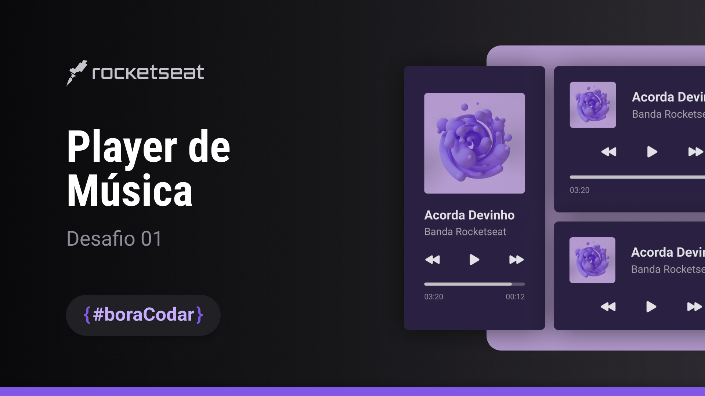

<h1 align="center">#BORACODAR</h1>

O #boracodar é uma realização feita pela a rocketseat, onde toda semana será enviado um desafio no site do <a href="https://www.rocketseat.com.br/boracodar">boracodar.</a> E no projeto da semana 01 foi disponibilizado esse layout de um player de música.

 

  <a href="#-tecnologias">Tecnologias</a>&nbsp;&nbsp;&nbsp;|&nbsp;&nbsp;&nbsp;
  <a href="#-projeto">Projeto</a>&nbsp;&nbsp;&nbsp;|&nbsp;&nbsp;&nbsp;
  <a href="#-layout">Layout</a>&nbsp;&nbsp;&nbsp;|&nbsp;&nbsp;&nbsp;
  <a href="#memo-licença">Licença</a>

  

 

  

## 🚀 Tecnologias

Esse projeto foi desenvolvido com as seguintes tecnologias:

- HTML
- CSS
- JavaScript
- Figma

## 💻 Projeto

- [Visite o projeto online](https://kelvinymickael.github.io/PLAYER_OF_MUSIC/)

## 🔖 Layout

Você pode visualizar o layout do projeto através [DESSE LINK](https://www.figma.com/file/0WtIJXlkZgKRYMB38RjDDC/Player-De-M%C3%BAsica?type=design&node-id=1-133&mode=design&t=Ngtovgnr6NSi4hSu-0). É necessário ter conta no [Figma](https://figma.com) para acessá-lo.

## :memo: Licença

Esse projeto está sob a licença MIT.

---

Developed By Kelviny Mickael.
